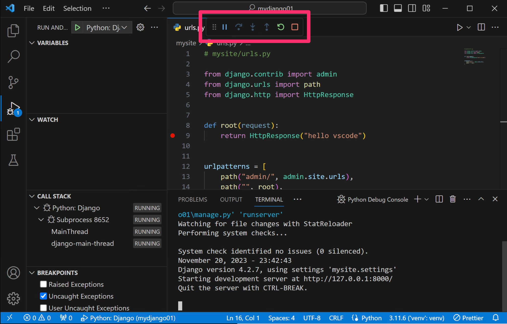

Visual Studio Code
====================

특징
------

Visual Studio Code(VSCode)는 Microsoft에서 개발한 강력한 무료 소스코드 편집기입니다.
하지만 정돈된 통합개발환경은 아니기에, 장고 웹 개발에 있어서 PyCharm Professional에 비해 아쉬운 것은 사실입니다.

AI 확장 기능에 있어서는 다양한 써드파티가 참여하여 `VSCode`_\, `Cursor`_\, `Windsurf`_ 등이 PyCharm보다 훨씬 낫습니다.
AI 기능이 파이참에 비해 아쉬운 부분을 많이 채워주긴 하지만, 상황에 따라 잘못된 코드가 생성될 수도 있기에 주의가 필요합니다.

.. _VSCode: https://code.visualstudio.com
.. _Cursor: https://www.cursor.com
.. _Windsurf: https://windsurfai.org

설치
------

두 방법 중에 편하신 방법으로 설치해주세요.

* 방법 #1. `공식 사이트 <https://code.visualstudio.com>`_\에서 다운로드 및 설치

* 방법 #2. 팩키지 매니저를 활용한 설치

  - 윈도우 : ``winget install microsoft.visualstudiocode --silent``
  - 맥 : ``brew install --cask visual-studio-code``

VSCode 필수 확장 및 설정
------------------------------

VSCode 기본은 편집기이지만, 다양한 확장을 통해 통합개발환경과 유사하게 구축할 수 있습니다.

* 파이썬 관련

  - ``ms-python.python`` : Python 개발을 위한 필수 확장. IntelliSense, 디버깅, 코드 탐색, 코드 포맷팅 등 Python 개발에 필요한 다양한 기능을 제공합니다.

  - ``ms-python.black-formatter`` : Python 코드를 자동으로 포맷팅해주는 Black 포맷터 확장. 일관된 코드 스타일을 유지하는데 도움을 줍니다.

* 장고 관련

  - ``batisteo.vscode-django`` : Django 개발을 위한 확장. Django 템플릿 문법 하이라이팅, 자동완성, 스니펫 등 Django 개발에 유용한 기능을 제공합니다.

  - ``Glavin001.unibeautify-vscode`` : 장고 템플릿 HTML에 prettier가 적용되면 템플릿 문법이 망가집니다. 이 확장은 장고 템플릿에서도 포맷팅을 지원합니다.

* HTML/CSS/JS 관련

  - ``esbenp.prettier-vscode`` : JavaScript, HTML, CSS 등의 코드를 자동으로 포맷팅해주는 Prettier 확장. 프론트엔드 코드의 일관성을 유지하는데 도움을 줍니다.

* 일반

  - ``PKief.material-icon-theme`` : 파일 및 폴더에 Material Design 아이콘을 적용하는 테마. 프로젝트 구조를 시각적으로 더 쉽게 파악할 수 있게 해줍니다.

.. tab-set::

    .. tab-item:: ``프로젝트/.vscode/extensions.json``

        아래 설정을 추가하면 확장 탭에서 추천 확장으로 확인하실 수 있습니다.

        .. code-block:: json

            {
                "recommendations": [
                    "ms-python.python",
                    "ms-python.black-formatter",
                    "batisteo.vscode-django",
                    "Glavin001.unibeautify-vscode",
                    "esbenp.prettier-vscode",
                    "PKief.material-icon-theme"
                ]
            }

    .. tab-item:: ``프로젝트/.vscode/settings.json``

        .. code-block:: json

            {
                "editor.tabSize": 4,          // 탭 크기
                "editor.formatOnSave": true,  // 저장 시에 자동 포맷팅
                // 각 파일에 대한 언어 지정
                "files.associations": {
                    "**/*.html": "html",
                    "**/*.js": "javascript",
                    "**/*.css": "css",
                    "**/templates/**/*.html": "django-html",
                    "**/templates/**/*": "django-txt",
                    "**/requirements{/**,*}.{txt,in}": "pip-requirements"
                },
                "emmet.includeLanguages": {
                    "django-html": "html"             // 장고 템플릿에서도 Emmet 사용 지원
                },
                "unibeautify.enabled": true,        // UniBeautify 확장 활성화
                "prettier.tabWidth": 2,             // 탭 크기 설정
                "prettier.singleQuote": false,      // 쌍 따옴표 사용 설정
                "prettier.semi": true,              // 세미콜론 사용 설정
                "prettier.trailingComma": "all",    // 후행 쉼표 설정
                "prettier.bracketSpacing": true,    // 객체 리터럴 내부의 중괄호 주위에 공백 추가 설정
                "prettier.bracketSameLine": false,  // 중괄호를 같은 줄에 배치
                "prettier.arrowParens": "always",   // 화살표 함수 파라미터에 항상 괄호 추가 설정
                // 각 언어별 디폴트 포맷터 지정
                "[python]": {
                    "editor.tabSize": 4,
                    "editor.defaultFormatter": "ms-python.black-formatter"
                },
                // 장고 템플릿에 prettier가 적용되지 않도록 합니다. 💪
                "[django-html]": {
                    "editor.tabSize": 2,
                    "editor.defaultFormatter": "Glavin001.unibeautify-vscode"
                },
                "[javascript]": {
                    "editor.defaultFormatter": "esbenp.prettier-vscode",
                },
                "[css]": {
                    "editor.defaultFormatter": "esbenp.prettier-vscode"
                },
                "[jsonc]": {
                    "editor.tabSize": 2,
                    "editor.defaultFormatter": "vscode.json-language-features"
                },
            }

가상환경 활성화하기
------------------------------

먼저 터미널에서 가상환경을 생성하시고, 장고 프로젝트를 활성화시켜주신 후에, vscode에서 프로젝트 폴더를 열어주세요.
vscode에서는 Python 확장의 ``Python: Select Interpreter`` 명령을 통해 현재 프로젝트에서 사용할 가상환경을 지정하실 수 있습니다.

<명령 팔레트>에서 "Python: Select Interpreter" 명령을 통해 활성화할 가상환경 경로를 지정합니다.

가상환경 경로가 있다면 선택하시고 없다면 ``"Enter interpreter path ..."`` 명령을 통해 가상환경 경로를 지정해주세요.

``"Terminal: Create New Terminal"`` 명령으로 새 터미널을 띄웁니다.
VSCode에 설정된 기본 터미널이 구동됩니다.

.. figure:: ./assets/vscode-venv-03.png

윈도우 기본 파워쉘로 구동될 경우 위와 같은 보안오류가 발생할 수 있습니다.
보안설정을 푸는 방법도 있지만, 최신 파워쉘을 사용하도록 하겠습니다.

최신 파워쉘 코어 7이 설치되어 있지 않다면, :doc:`/setup/terminals/windows` 문서를 참고해서 설치해주세요.

파워쉘 코어 7을 설치가 된 상황에서, ``Select Default Profile`` 메뉴로 기본 터미널을 변경해줍니다.

최신 파워쉘인 ``pwsh.exe``\를 선택해주세요.
터미널의 쓰레기통 아이콘을 눌러 터미널 창을 닫고 ``"Terminal: Create New Terminal"`` 명령으로 다시 터미널을 열어줍니다.

터미널 이름이 ``pwsh.exe``\로 뜨시면 파워쉘 7로 터미널이 구동된 것입니다. 앞서 설정한 가상환경으로 자동으로 활성화되었습니다.

VSCode로 장고 디버깅하기
----------------------------------

장고 개발하실 때, VSCode를 단순히 편집기로만 쓰셨나요?
VSCode에서는 장고를 포함한 다양한 파이썬 애플리케이션을 디버깅할 수 있습니다.

디버깅하실 때 상상은 그만 !!! ``print`` 명령어도 이제 그만 !!!

VSCode 네번째 탭인 ``Debug`` 탭을 클릭해주세요. 이 탭에서 디버깅을 시작하실 수 있고, 디버깅 설정 파일을 생성하실 수 있습니다.
``Run and Debug`` 버튼을 클릭하시면 디버깅 설정파일 생성없이 즉시 디버깅을 시작하실 수 있습니다.
하지만 ``Run and Debug`` 버튼을 클릭하지 마시고 ``create a launch.json file``\을 클릭해서 먼저 디버깅 설정 파일을 생성하시기를 추천드립니다.
디버깅 설정 파일을 생성해두시면 디버깅 설정을 쉽게 변경할 수 있고, 변경된 설정으로 디버깅을 시작할 수 있습니다.

``create a launch.json file`` 버튼을 클릭하면, ``Select Debugger`` 선택 창이 뜨고 ``Python Debugger``\를 선택해주세요.
그럼 Python 확장을 통해 지원되는 다양한 디버깅 설정이 뜹니다. 이 중에 ``Django``\를 선택합니다.

그럼 ``.vscode/launch.json`` 파일이 생성되고, 디버깅 구성 파일이 생성됩니다.
이 파일을 통해 장고 서버를 구동할 수 있으며 디버깅도 할 수 있습니다.

.. figure:: ./assets/vscode-django-setup-03.png

VSCode에서 디버거를 구동하면 장고 서버가 구동되기 때문에,
앞서 터미널에서 구동한 장고 개발서버가 있다면 먼저 꺼주세요.

아래 코드를 구현하고 VSCode에서 중단점을 찍어봅시다.

.. code-block:: python
    :caption: mysite/urls.py

    from django.contrib import admin
    from django.urls import path
    from django.http import HttpResponse

    def root(request):
        return HttpResponse("hello vscode")

    urlpatterns = [
        path("admin/", admin.site.urls),
        path("", root),
    ]

줄번호 왼쪽 영역을 클릭하여 중단점을 생성/제거하실 수 있습니다.
디버거를 실행하면 장고에서 9번 라인이 실행되기 전에 실행이 중단됩니다.

녹색 화살표 버튼을 클릭하면 디버거가 실행되며, 장고 서버가 구동됩니다.

디버그 메뉴는 순서대로 다음과 같습니다:

- Pause (일시정지): 실행 중인 코드를 일시정지합니다.
- Step Over (단계 넘기기): 현재 라인을 실행하고 다음 라인으로 이동합니다. 함수 호출이 있다면 함수 내부로 들어가지 않고 건너뜁니다.
- Step Into (단계 안으로): 현재 라인을 실행하고 함수 호출이 있다면 함수 내부로 들어가서 디버깅합니다.
- Step Out (단계 나가기): 현재 함수의 실행을 완료하고 함수를 호출한 지점으로 돌아갑니다.
- Restart (재시작): 디버깅을 처음부터 다시 시작합니다.
- Stop (중지): 디버깅을 종료합니다.

웹브라우저를 열고 http://localhost:8000 주소로 접속하시면
아래와 같이 중단점에서 실행이 멈춰있음을 확인하실 수 있습니다.

``VARIABLES`` 패널을 통해 중단점에서의 변수 내역을 확인하실 수 있고,
``WATCH`` 패널에 조회를 원하는 변수나 표현식을 쓰시면 실시간으로 그 값을 확인하실 수 있습니다.
``Pause`` 아이콘이 ``Continue`` 아이콘으로 변경되어있습니다.
``Continue`` 아이콘을 클릭하시면 장고 서버가 이어서 다음 중단점까지 계속 실행됩니다.
디버깅이 끝났다면 중단점을 클릭하여 중단점을 제거해주세요.
